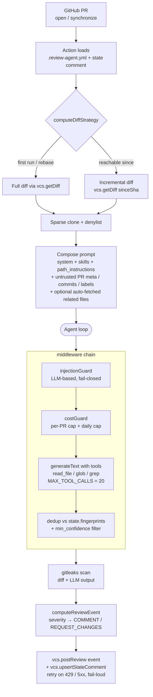

# review-agent

Self-hosted, BYOK AI code-review agent for GitHub Pull Requests.

**English** | [日本語](./docs/README.ja.md)

> Personal project — published as open source for reference, not accepting
> external contributions. Forks are welcome.

## What it does

`review-agent` runs as a GitHub Action on your PRs. It:

- Posts inline comments tied to specific lines, plus a single summary
  comment per review. Each comment carries optional `category` (bug /
  security / performance / maintainability / style / docs / test),
  `confidence` (high / medium / low), and `ruleId` so operators can
  aggregate, suppress, and dedupe findings across providers.
- Calibrates severity against a published rubric (critical / major /
  minor / info with before/after examples) baked into the system
  prompt, and switches the GitHub review event to `REQUEST_CHANGES`
  on critical findings (opt-in via `reviews.request_changes_on`).
- Deduplicates findings across pushes via a hidden state comment
  (`<!-- review-agent-state: ... -->`) and per-finding fingerprints,
  and sends only the **incremental** diff to the LLM on the 2nd+
  push so reviewers don't pay for the whole PR on every commit.
- Exposes `read_file` / `glob` / `grep` tools to the model so it can
  pull in test companions, type declarations, and siblings as it
  reviews — bounded by a per-review `MAX_TOOL_CALLS` budget plus an
  auto-fetch budget on `path_instructions[i].auto_fetch`.
- Honours an opt-in `.review-agent.yml` config — language, profile
  (`chill` / `assertive`), provider/model, cost cap, ignored authors,
  path-scoped instructions (with auto-fetch + glob validation),
  skills, confidence floor, severity threshold for REQUEST_CHANGES,
  and (Server mode) workspace strategy.
- Scans diffs and any agent-collected text with [`gitleaks`](https://github.com/gitleaks/gitleaks)
  before posting; aborts review on secret leakage in agent output.
- Runs in a non-root sandboxed Docker container with denylisted paths
  (`.env*`, `.git/`, `node_modules/`, `.aws/credentials`, secret stores)
  enforced at BOTH the provisioner and the tool dispatcher, and
  partial+sparse clone of just the changed paths.
- Caps cost per PR (`cost-cap-usd`, default `1.0`) and short-circuits
  the agent loop the moment the cap is reached.
- Ships a `review-agent audit export` / `audit prune` CLI for
  operator-driven retention of `audit_log` / `cost_ledger`, with
  HMAC-chain re-verification on prune (Server mode).
- Retries the state-comment write on transient GitHub failures
  (configurable via the `state-write-retries` action input) and fails
  loud on exhaustion so the next push doesn't silently re-review the
  whole PR.

## Quick start (GitHub Action)

```yaml
# .github/workflows/review.yml
name: review-agent
on:
  pull_request:
    types: [opened, synchronize, ready_for_review]

permissions:
  contents: read
  pull-requests: write

jobs:
  review:
    runs-on: ubuntu-latest
    steps:
      - uses: actions/checkout@v4
      - uses: almondoo/review-agent@v0  # pin a tag in production
        with:
          anthropic-api-key: ${{ secrets.ANTHROPIC_API_KEY }}
          language: en-US
          cost-cap-usd: '1.0'
```

Add `ANTHROPIC_API_KEY` to your repository secrets. The default
`secrets.GITHUB_TOKEN` is used to post comments.

## Configuration

Drop a `.review-agent.yml` at your repository root. Every field is
optional; defaults are spec-aligned and conservative.

```yaml
language: en-US                  # ISO 639-1 + region
profile: chill                   # chill | assertive
provider:
  type: anthropic
  model: claude-sonnet-4-6
reviews:
  auto_review:
    drafts: false                # skip until ready_for_review
  ignore_authors:                # default skips dep bots
    - dependabot[bot]
    - renovate[bot]
    - github-actions[bot]
  path_instructions:
    - path: "packages/core/**"
      instructions: "Public API. Flag breaking changes explicitly."
skills:
  - .claude/skills/security.md   # user-supplied skills only at v0.1
```

The full schema lives in [`schema/v1.json`](./schema/v1.json) and powers
IDE autocomplete via:

```json
// .vscode/settings.json
{ "yaml.schemas": { "./schema/v1.json": [".review-agent.yml"] } }
```

## How it works

Each review goes through a fixed pipeline: GitHub fires a PR event,
the Action loads config + previous state, the runner composes a
prompt and drives the LLM through a middleware chain, and the
post-processed output is posted back as inline comments + a summary +
a hidden state comment for the next push to diff against.



What each block does:

- **Action** (`packages/action/src/run.ts`) — entry point in the workflow runner. Loads config, fetches PR metadata, decides skip rules (drafts / ignored authors / labels), and seeds the workspace.
- **`computeDiffStrategy`** (`packages/core/src/incremental.ts`) — picks between **full** review (first run, force-push, or unreachable `lastReviewedSha`) and **incremental** review (delta against the previous head). Saves the LLM cost of re-reviewing the whole PR on every push.
- **Workspace** (`packages/runner/src/tools.ts`) — partial + sparse clone of just the changed paths. Denylist (`.env*`, `.git/`, `node_modules/`, `.aws/credentials`, secret stores) enforced at the provisioner AND the tool dispatcher.
- **Prompt composition** (`packages/runner/src/prompts/`) — system prompt (severity rubric, what-NOT-to-flag, category / confidence / ruleId guidance) + skills + path_instructions + a single `<untrusted>` envelope containing PR title / body / author / labels / base branch / commit messages + optional `<related_files>` block from `path_instructions[i].auto_fetch`. Everything user-supplied is inside the envelope; closing-tag substrings are escaped.
- **Middleware chain** (`packages/runner/src/agent.ts`):
  - `injectionGuard` — LLM-based prompt-injection classifier; fail-closed on uncertain verdicts.
  - `costGuard` — short-circuits the agent loop if the per-PR `cost-cap-usd` or installation daily cap is reached.
  - `main` — `generateText({ tools, stopWhen: stepCountIs(MAX_TOOL_CALLS), experimental_output: Output.object({ schema: ReviewOutputSchema }) })`. The LLM may invoke `read_file` / `glob` / `grep` against the workspace.
  - `dedup` — drops findings whose `(path, line, ruleId, suggestionType)` fingerprint is already in the hidden state comment; also applies the `reviews.min_confidence` floor.
- **gitleaks** (`packages/runner/src/gitleaks.ts`) — scans both the diff and the LLM's generated output; aborts the review on secret leakage in agent output.
- **`computeReviewEvent`** (`packages/core/src/review.ts`) — maps the kept comment list to `COMMENT` / `REQUEST_CHANGES` per `reviews.request_changes_on` (default: `critical`).
- **Post + state** (`packages/platform-github/src/adapter.ts`) — `postReview` carries the chosen event (so branch protection can require "no request-changes" reviews); `upsertStateComment` writes the new fingerprint set + head/base SHAs for the next push to diff against. Both calls are wrapped in retry on 429 / 5xx with exp-backoff; state-write exhaustion fails the action loud.

In **Server mode** (Hono webhook → SQS → worker) the same runner is invoked from `packages/server/src/worker.ts`. The worker provisions a per-job ephemeral workspace via `provisionWorkspace` (strategy: `contents-api` for Lambda, `sparse-clone` when `git` is available); everything downstream of "Workspace" in the diagram is identical.

## Supported VCS platforms

| Platform | Modes | Status | Notes |
|---|---|---|---|
| **GitHub** (`platform-github`) | GitHub Action / Server (webhook → SQS) / CLI | ✅ Full support | Default. Hidden-state-comment dedup + `REQUEST_CHANGES` mapping. |
| **GitHub Enterprise Server** | Server / CLI | ✅ Supported | Uses the same Octokit path. See [`docs/deployment/ghes.md`](./docs/deployment/ghes.md). |
| **AWS CodeCommit** (`platform-codecommit`) | CLI / Server (manual trigger) | ⚠️ Partial | Adapter ships and posts reviews. Automatic event ingestion (SNS → SQS) and CLI `--platform codecommit` flag are tracked in [#73](https://github.com/almondoo/review-agent/issues/73) / [#75](https://github.com/almondoo/review-agent/issues/75). Postgres-canonical state (no hidden-comment markers — see spec §12.1.1). |

> **CodeCommit data-durability warning.** CodeCommit installations store
> review state in Postgres only — the platform side has no canonical
> copy. If Postgres is lost, the next review on every open PR is a full
> re-run. Plan backups (RDS PITR / Aurora snapshots) and follow the
> dedicated runbook at
> [`docs/operations/codecommit-disaster-recovery.md`](./docs/operations/codecommit-disaster-recovery.md)
> before going to production.

GitLab / Bitbucket adapters are out of scope for v1.x (spec §1.2).

## Repo layout

```
packages/
  core/                # types, schemas, fingerprinting (no I/O)
  llm/                 # Vercel AI SDK provider adapters + retry/error mapping
  config/              # zod-typed YAML loader, env-merge, JSON schema export
  platform-github/     # VCS impl: clone, diff, comments, hidden state (GitHub)
  platform-codecommit/ # VCS impl: AWS CodeCommit (Postgres-canonical state)
  runner/              # agent loop, tools, prompts, gitleaks, skill loader
  action/              # GitHub Action wrapper (entry point)
  eval/                # promptfoo regression suite + golden PR fixtures
```

See [`docs/specs/review-agent-spec.md`](./docs/specs/review-agent-spec.md)
for the full specification and [`docs/roadmap.md`](./docs/roadmap.md) for
the milestone plan.

For the per-provider feature parity, eval delta, and cost / latency
trade-offs across the seven supported drivers, see
[`docs/providers/parity-matrix.md`](./docs/providers/parity-matrix.md).

## Status

Maintained as a personal project. Code is published under the
[LICENSE](./LICENSE) for reference and reuse, but external contributions
are not accepted.

- **Pull Requests**: Closed without review. See [CONTRIBUTING.md](./.github/CONTRIBUTING.md).
- **Issues**: Used for internal task tracking only.
- **Forks**: Welcome.

### Versioning

From `v1.0.0` onwards `review-agent` follows
[Semantic Versioning](https://semver.org/). The public API surface,
internal-only surfaces, and per-version migration steps are in
[UPGRADING.md](./UPGRADING.md). Pre-v1.0 (`0.x`) releases are not
SemVer-stable.

## Security

See [SECURITY.md](./SECURITY.md) for the threat model, reporting process,
and the mitigations baked into the runner (sandbox, denylist, gitleaks,
prompt-injection guard, cost cap).

## License

[Apache-2.0](./LICENSE).
