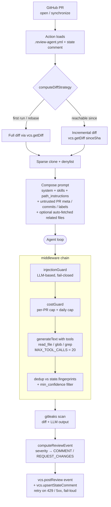

# review-agent

GitHub Pull Request 向けの、セルフホスト・BYOK 型 AI コードレビューエージェント。

[English](../README.md) | **日本語**

> 個人プロジェクトです。リファレンス用途で OSS 公開していますが、外部から
> の Pull Request は受け付けていません。fork は歓迎します。

## 概要

`review-agent` は GitHub Action として PR 上で動作します。主な機能:

- 行単位のインラインコメント + レビュー 1 回ごとに 1 件のサマリーコメントを投稿します。
  各コメントには optional な `category`（bug / security / performance /
  maintainability / style / docs / test）、`confidence`（high / medium / low）、
  `ruleId` が付与され、プロバイダ横断で集計・抑制・重複排除ができます。
- システムプロンプトに焼き込まれた重要度ルーブリック（critical / major /
  minor / info、before/after 例つき）に対して severity を較正し、critical
  検知時に GitHub レビュー event を `REQUEST_CHANGES` に切り替えます（`reviews.request_changes_on`
  で opt-in）。
- 隠し state コメント（`<!-- review-agent-state: ... -->`）と finding ごとの
  fingerprint で push 間の重複排除を行い、2 回目以降の push では **incremental
  diff** のみを LLM に送るので、コミットのたびに PR 全体のレビュー料金を払わずに済みます。
- `read_file` / `glob` / `grep` ツールを LLM に公開し、テスト併設ファイル・
  型定義・兄弟ファイルを引き寄せながらレビューできます。レビュー当たり
  `MAX_TOOL_CALLS` で上限を持たせつつ、`path_instructions[i].auto_fetch`
  での先回り取得バジェットも設けています。
- `.review-agent.yml` の opt-in 設定に従います（言語、profile（`chill` / `assertive`）、
  provider / model、cost cap、無視する author、path-scoped 指示（auto-fetch + glob 検証つき）、
  skill、confidence floor、REQUEST_CHANGES の severity 閾値、Server モードの
  workspace 戦略）。
- diff とエージェント収集テキストを投稿前に [`gitleaks`](https://github.com/gitleaks/gitleaks)
  でスキャンし、エージェント出力に secret 漏えいがあればレビューを中止します。
- 非 root の sandbox Docker コンテナで動作し、denylist パス（`.env*`、`.git/`、
  `node_modules/`、`.aws/credentials`、secret store）を **provisioner とツールディスパッチャの
  両側**で強制し、変更パスだけの partial+sparse clone を取得します。
- PR 単位の cost cap（`cost-cap-usd`、default `1.0`）を超えた瞬間にエージェントループを
  short-circuit します。
- `review-agent audit export` / `audit prune` CLI を提供し、`audit_log` /
  `cost_ledger` の運用主導の retention を可能にします。prune 後は HMAC chain
  を再検証します（Server モード）。
- state コメント書き込みを GitHub の一時的失敗時に retry し（`state-write-retries`
  action input で設定可能）、リトライ枯渇時は fail-loud にして action を失敗させます。
  次の push で PR 全体を黙って再レビューしてしまう事故を防ぎます。

## クイックスタート (GitHub Action)

```yaml
# .github/workflows/review.yml
name: review-agent
on:
  pull_request:
    types: [opened, synchronize, ready_for_review]

permissions:
  contents: read
  pull-requests: write

jobs:
  review:
    runs-on: ubuntu-latest
    steps:
      - uses: actions/checkout@v4
      - uses: almondoo/review-agent@v0  # 本番ではタグ固定
        with:
          anthropic-api-key: ${{ secrets.ANTHROPIC_API_KEY }}
          language: ja-JP
          cost-cap-usd: '1.0'
```

`ANTHROPIC_API_KEY` をリポジトリの secret に追加してください。コメント投稿には
default の `secrets.GITHUB_TOKEN` を使います。

## 設定

リポジトリ直下に `.review-agent.yml` を置きます。すべてのフィールドは optional
で、default は spec に沿った保守的な値です。

```yaml
language: ja-JP                  # ISO 639-1 + region
profile: chill                   # chill | assertive
provider:
  type: anthropic
  model: claude-sonnet-4-6
reviews:
  auto_review:
    drafts: false                # ready_for_review までスキップ
  ignore_authors:                # default で依存 bot をスキップ
    - dependabot[bot]
    - renovate[bot]
    - github-actions[bot]
  path_instructions:
    - path: "packages/core/**"
      instructions: "公開 API。破壊的変更は明示的にフラグ。"
skills:
  - .claude/skills/security.md   # v0.1 ではユーザ提供 skill のみ
```

完全なスキーマは [`schema/v1.json`](../schema/v1.json) にあり、IDE の補完は次のように
有効化できます:

```json
// .vscode/settings.json
{ "yaml.schemas": { "./schema/v1.json": [".review-agent.yml"] } }
```

## 仕組み

各レビューは固定パイプラインを通ります — GitHub が PR event を発火 → Action
が config + 前回 state を読み込み → runner がプロンプトを組み立てて LLM を
middleware chain で駆動 → 後処理を経てインラインコメント + サマリー + 次回 push
が diff するための隠し state コメントとして投稿。



各ブロックの役割:

- **Action** (`packages/action/src/run.ts`) — workflow runner のエントリポイント。
  config 読み込み、PR メタデータ取得、スキップ判定（drafts / ignore_authors / labels）、
  workspace 用意を行う。
- **`computeDiffStrategy`** (`packages/core/src/incremental.ts`) — **full** レビュー
  （初回 / force-push / `lastReviewedSha` に到達不能）と **incremental** レビュー
  （前回 head との差分）を選択する。push のたびに PR 全体を再レビューする LLM コストを
  削減する。
- **Workspace** (`packages/runner/src/tools.ts`) — 変更パスだけの partial + sparse
  clone。denylist（`.env*`、`.git/`、`node_modules/`、`.aws/credentials`、secret store）
  は provisioner とツールディスパッチャの両方で強制される。
- **Prompt composition** (`packages/runner/src/prompts/`) — システムプロンプト
  （severity ルーブリック、何を flag しないか、category / confidence / ruleId のガイダンス）
  + skill + path_instructions + 単一の `<untrusted>` envelope（PR の title / body /
  author / labels / base branch / commit messages を内包）+ optional な `<related_files>`
  ブロック（`path_instructions[i].auto_fetch` 由来）。ユーザ供給テキストはすべて
  envelope の内側に置かれ、閉じタグ部分文字列は escape される。
- **Middleware chain** (`packages/runner/src/agent.ts`):
  - `injectionGuard` — LLM ベースの prompt-injection 分類器。判定不確実時は fail-closed。
  - `costGuard` — PR 単位の `cost-cap-usd` または installation 単位の daily cap に
    達した場合、エージェントループを short-circuit する。
  - `main` — `generateText({ tools, stopWhen: stepCountIs(MAX_TOOL_CALLS),
    experimental_output: Output.object({ schema: ReviewOutputSchema }) })`。LLM は
    workspace に対して `read_file` / `glob` / `grep` を呼び出せる。
  - `dedup` — 隠し state コメントに既存の `(path, line, ruleId, suggestionType)`
    fingerprint を持つ finding を drop。さらに `reviews.min_confidence` の floor を
    適用する。
- **gitleaks** (`packages/runner/src/gitleaks.ts`) — diff と LLM 生成出力の両方を
  スキャン。エージェント出力に secret 漏えいがあればレビューを中止する。
- **`computeReviewEvent`** (`packages/core/src/review.ts`) — `reviews.request_changes_on`
  （default: `critical`）に従って、残ったコメントリストを `COMMENT` / `REQUEST_CHANGES`
  にマッピング。
- **Post + state** (`packages/platform-github/src/adapter.ts`) — `postReview` は
  選択された event を運ぶ（branch protection で "no request-changes" を要求できる）。
  `upsertStateComment` は次回 push が diff する用の新しい fingerprint 集合 + head/base
  SHA を書き込む。両呼び出しは 429 / 5xx に対する exp-backoff retry でラップされ、
  state-write 枯渇時は action を fail-loud で失敗させる。

**Server モード**（Hono webhook → SQS → worker）では同じ runner が
`packages/server/src/worker.ts` から呼ばれる。worker は `provisionWorkspace`
（strategy: Lambda は `contents-api`、`git` 利用可なら `sparse-clone`）で
ジョブ単位の一時 workspace を用意する。図の "Workspace" 以降は完全に同一。

## リポジトリ構成

```
packages/
  core/              # 型・スキーマ・fingerprint（I/O なし）
  llm/               # Vercel AI SDK provider adapter + retry/error mapping
  config/            # zod 型付き YAML loader、env マージ、JSON schema 出力
  platform-github/   # VCS 実装: clone / diff / コメント / 隠し state
  runner/            # エージェントループ、ツール、プロンプト、gitleaks、skill loader
  action/            # GitHub Action ラッパー（エントリポイント）
  eval/              # promptfoo 回帰スイート + golden PR fixture
```

完全な仕様は [`docs/specs/review-agent-spec.md`](./specs/review-agent-spec.md)、
マイルストーン計画は [`docs/roadmap.md`](./roadmap.md) を参照してください。

サポートする 7 つのドライバ間の機能 parity、eval 差分、コスト / レイテンシの
トレードオフは [`docs/providers/parity-matrix.md`](./providers/parity-matrix.md)
にあります。

## ステータス

個人プロジェクトとしてメンテナンスしています。コードは [LICENSE](../LICENSE)
の下でリファレンス目的に公開していますが、外部からの contribution は受け付けて
いません。

- **Pull Request**: レビューせずクローズします。詳しくは [CONTRIBUTING.md](../.github/CONTRIBUTING.md)。
- **Issue**: 内部タスク追跡のみに使用しています。
- **Fork**: 歓迎します。

### バージョニング

`v1.0.0` 以降、`review-agent` は [Semantic Versioning](https://semver.org/)
に従います。公開 API surface、内部 surface、バージョン間の移行手順は
[UPGRADING.md](../UPGRADING.md) に記載しています。v1.0 より前（`0.x`）は
SemVer 安定ではありません。

## セキュリティ

脅威モデル、報告手順、runner に組み込まれた緩和策（sandbox、denylist、gitleaks、
prompt-injection guard、cost cap）は [SECURITY.md](../SECURITY.md) を参照
してください。

## ライセンス

[Apache-2.0](../LICENSE)。
